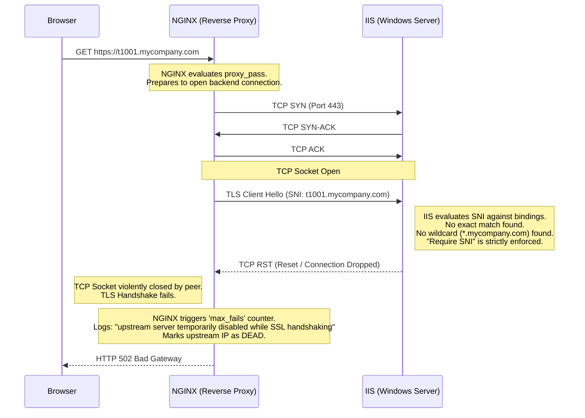
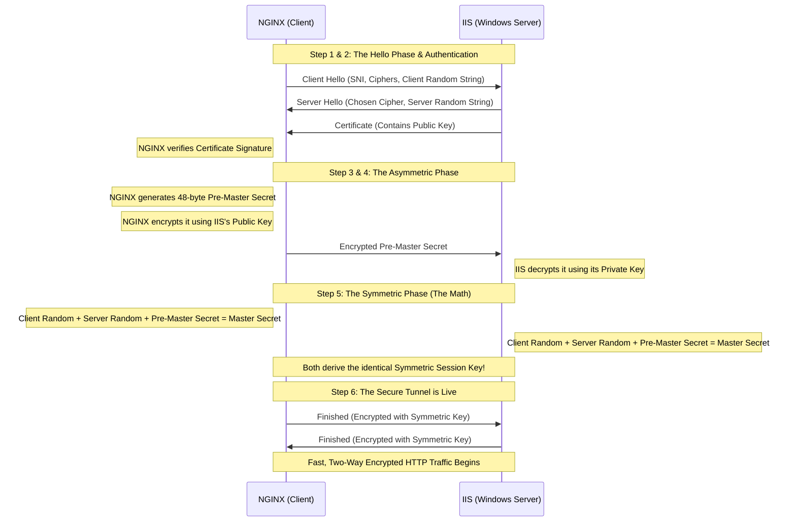
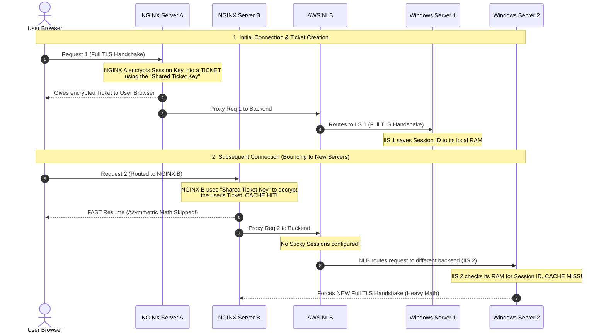

### Phase 1: The Baseline (How Plain HTTP Works)
To understand why SNI was invented, we must first look at how easy unencrypted web traffic is.

Imagine your NGINX proxy receives a request from a user and needs to fetch data from your backend Windows server for Tenant 1 (`t1.mycompany.com`).
1. **The TCP Handshake (Layer 4):** NGINX sends a `SYN` packet to the Windows Server on Port 80. The server replies `SYN-ACK`, and NGINX replies `ACK`. The pipe is open.
2. **The HTTP Request (Layer 7):** Because there is no encryption, NGINX immediately pushes raw text (Including HOST header) down the pipe:
   ```http
   GET / HTTP/1.1
   Host: t1.mycompany.com
   ```
3. **The IIS Routing:** The Windows server reads the `Host` header, looks at its internal list of websites, finds the one for `t1.mycompany.com`, and serves the correct files.

### Phase 2: The Introduction of HTTPS and the "Chicken and Egg" Problem
Now, we secure the traffic by changing Port 80 to Port 443 (HTTPS). This introduces a massive architectural roadblock.

With HTTPS, NGINX and the Windows Server **must** establish a cryptographically secure tunnel *before* any HTTP data (like the `Host: t1.mycompany.com` header) can be transmitted. 

**The Deadlock:**
* To build the encrypted tunnel, the Windows Server must present an SSL Certificate to NGINX to prove its identity and provide the encryption keys.
* But the Windows Server hosts 1,000 different tenants (`t1` through `t1000`), each potentially needing a different certificate.
* The server doesn't know which tenant NGINX wants because the `Host` header is locked inside the HTTP payload, which cannot be sent until the tunnel is built!


### Phase 3: The SNI Solution (Server Name Indication)
To break this deadlock, engineers modified the TLS (Transport Layer Security) protocol to include an extension called **SNI**.

SNI allows the client (NGINX) to inject the requested hostname into the very first, *unencrypted* handshake packet. 

Because you configured `proxy_ssl_server_name on;` and `proxy_ssl_name $host;` in NGINX, here is what NGINX actually sends over the wire:
*"Hello Windows Server. I want to start a TLS handshake. By the way (SNI Extension), I am specifically looking for the certificate for `t50.mycompany.com`."*


### Phase 4: Scaling to Multi-Tenant with Wildcards
Managing 1,000 distinct SNI bindings in IIS for `t1.mycompany.com`, `t2.mycompany.com`, etc., is an operational nightmare. If a new tenant signs up, the system breaks until an admin adds `t1001` to IIS.

This is solved using **Wildcards**:
1. **The Certificate:** You install a single Wildcard SSL Certificate issued to `*.mycompany.com`.
2. **The IIS Binding:** You create one HTTPS binding on Port 443. For the hostname, you literally type `*.mycompany.com` and check the box for "Require Server Name Indication".

Now, when NGINX sends an SNI request for `t999.mycompany.com`, IIS sees the `*.mycompany.com` binding, recognizes it as a valid wildcard match, and presents the certificate.


---

### Phase 5: The Failure State (Why you got a 502 Bad Gateway)

This brings us to your exact outage. What happens if a request comes in for a tenant, but IIS does *not* have a matching specific binding or a wildcard binding to fall back on?



**The Step-by-Step Breakdown of the Failure:**
1. **The Missing Binding:** Your IIS server lacked the correct hostname in its binding list and didn't have a catch-all wildcard.
2. **The TCP Reset:** Because IIS enforces SNI strictly, when it receives a `Client Hello` for an unknown name, it does not send an HTTP error. It kills the connection at Layer 4 by sending a `TCP RST` (Reset) packet. 
3. **The NGINX Reaction:** NGINX's proxy module is waiting for a `Server Hello` back from Windows. Instead, the network socket is slammed shut.
4. **The Log Entry:** NGINX logs `upstream server temporarily disabled while SSL handshaking`. It does this because it assumes the backend server is crashing or overloaded since it can't even complete a basic TLS handshake.
5. **The 502 Error:** NGINX has an active connection with the user's browser, but the backend connection was destroyed. NGINX must return something to the user, so it generates an **HTTP 502 Bad Gateway**, which literally means: *"I am acting as a gateway, and the upstream server gave me an invalid (or dropped) response."*

---

### Phase 6: The Success State (The Cryptographic TLS Handshake)

When you fixed the binding (or if you use a wildcard), the handshake succeeds. Here is the deep technical detail of how NGINX and IIS generate the "Secure String" (Session Key) to encrypt the traffic.

Here is how the "Secure String" is generated step-by-step:




---

### The Multi-Server Dilemma: What Happens When You Have Multiple Servers?


### Phase 7: The Multi-Server Dilemma (Frontend vs. Backend Caching)

Everything we discussed about **TLS Session Resumption** (caching the session to save CPU) works perfectly on a single server. However, it completely falls apart when you introduce multiple NGINX servers and multiple Windows servers if a request goes to a different server each time.

Because each hop represents a separate TLS connection, passing traffic across a cluster of servers breaks standard "in-memory" caching. Here is exactly what happens on both sides of your architecture and how it is handled.


#### 1. The Frontend Problem (Multiple NGINX Servers)
Imagine a user connects to **NGINX Server A**. 
* They perform the full TLS handshake (heavy math). 
* Server A saves the Session ID and the Symmetric Key in its local RAM (`ssl_session_cache`).
* Five minutes later, the user clicks another link, but your external DNS/Load Balancer sends them to **NGINX Server B**.

**What Happens:**
The user's browser sends a `Client Hello` saying, *"Hey, I have Session ID #12345, let's resume!"* **NGINX Server B** checks its local RAM, realizes it has no record of that ID, and **forces a brand new, full handshake**. If your traffic bounces randomly across 5 NGINX servers, your RAM cache is basically useless, and your CPUs will still spike.

**The Solution: Shared TLS Session Tickets**
Instead of storing the session in the server's isolated RAM, you use **Session Tickets**. 
* NGINX takes the Symmetric Key, encrypts it into a "Ticket", and gives it to the user's browser to hold onto.
* When the user hits **NGINX Server B**, they hand over the Ticket.
* **The Fix:** By generating a shared encryption key (`ssl_session_ticket_key`) and placing that exact same file on *all* your NGINX servers, Server B can seamlessly decrypt the ticket issued by Server A and instantly resume the session!

#### 2. The Backend Problem (Multiple Windows Servers behind an NLB)
Now look at the connection between your NGINX proxies and the backend Windows servers. 
* NGINX establishes a session with **Windows Server 1** through the AWS NLB.
* NGINX tries to reuse that session (`proxy_ssl_session_reuse on;`) on the next request, but the NLB routes this specific request to **Windows Server 2**.


**What Happens:**
Just like the frontend problem, Windows Server 2 does not share RAM with Windows Server 1. It sees the Session ID from NGINX, realizes it has no record of it, and **rejects the abbreviated handshake**. NGINX and Windows Server 2 are forced to do the heavy asymmetric math all over again.

**The Solution vs. Your Reality:**
In IIS, sharing TLS session state across multiple servers is incredibly complex. The industry-standard way to solve this is to enable **Sticky Sessions (Target Group Stickiness)** at the AWS NLB layer, forcing NGINX to always hit the same Windows server so the RAM cache works. 

However, **because your architecture explicitly does not use Sticky Sessions**, you are utilizing standard round-robin/hash routing. 
* **The Reality:** Your system accepts the CPU penalty of performing full TLS handshakes on the backend in exchange for better, more even load distribution across the Windows pool. 

---

### Diagram: Your Architecture in Action
Here is the sequence diagram showing the frontend successfully resuming sessions via Shared Tickets, while the backend experiences standard cache misses due to the round-robin NLB routing.




---

Asymmetric cryptography (Public/Private keys) is mathematically heavy and slow. If you used it to encrypt every megabyte of web traffic, your servers' CPUs would melt. Instead, NGINX and IIS use Asymmetric math *just once* to securely agree on a fast, shared Symmetric key.

1. **Client Hello:** NGINX sends the SNI (`t1.mycompany.com`), a list of supported ciphers, and a **Client Random** string of 32 bytes.
2. **Server Hello & Certificate:** IIS matches the SNI, selects a cipher, generates a **Server Random** string of 32 bytes, and sends its Public SSL Certificate down the wire.
3. **Authentication:** NGINX verifies the certificate's cryptographic signature against its trusted Root CAs.
4. **The Pre-Master Secret (The Asymmetric Phase):**
    * NGINX generates a highly secure, 48-byte random string called the **Pre-Master Secret**.
    * NGINX extracts the *Public Key* from the IIS certificate.
    * NGINX uses that Public Key to encrypt the Pre-Master Secret. Once encrypted, **only the Windows Server's Private Key** can decrypt it. Hackers see only mathematical noise.
    * NGINX sends this encrypted Pre-Master Secret to the Windows Server.
5. **Generating the Session Keys (The Symmetric Phase):**
    * The Windows Server receives the payload and uses its Private Key to decrypt the Pre-Master Secret.
    * Now, *both* NGINX and IIS possess the exact same three ingredients: The **Client Random**, the **Server Random**, and the **Pre-Master Secret**.
    * Both servers independently run these three ingredients through a Pseudo-Random Function (PRF).
    * The output of this function is the **Master Secret** (the "Secure String").
    * From this Master Secret, they derive the final **Symmetric Session Keys** (usually AES-GCM).
6. **The Secure Tunnel is Live:** Both sides send a `Finished` message encrypted with the new Symmetric Session Key. Asymmetric math is completely discarded. The HTTP `Host` header and web data can now flow at lightning speed.

*(Note: In TLS 1.3, this process is optimized using Diffie-Hellman Ephemeral key exchange to do this in fewer round-trips, but the core concept of asymmetric key-agreement generating a symmetric session key remains the same).*

To optimize your architecture, we need to address the "hidden tax" of HTTPS: **the CPU cost of the TLS handshake.**

As we covered, the asymmetric math (using Public/Private keys to generate the Pre-Master Secret) is highly secure but incredibly computationally heavy. If NGINX and your Windows server perform this full math equation for *every single request* or every new connection, your CPUs will spike, and your users will experience higher latency (slower Time to First Byte).

The solution is **TLS Session Resumption** (Caching). Once NGINX and the server do the hard math once, they can "save" the resulting Symmetric Session Key for a period of time. When the client reconnects, they skip the hard math and jump straight to the fast, encrypted tunnel.

Here is exactly how to configure this on NGINX for both your front-end users and your backend Windows servers.

---

### 1. How TLS Session Resumption Works

When a client and server successfully complete a full TLS handshake, the server generates a unique **Session ID** (or a **Session Ticket**) and sends it to the client.

1.  **The First Visit (Full Handshake):** The heavy asymmetric math is performed. The Symmetric Key is generated. NGINX stores the Session ID and the Symmetric Key in its RAM.
2.  **The Reconnect (Abbreviated Handshake):** The client connects again and includes the Session ID in its `Client Hello` packet.
3.  **The Shortcut:** NGINX checks its RAM. If it finds the matching Session ID, it says, *"I remember you, and I still have our Symmetric Key."* 4.  **Instant Tunnel:** They skip the asymmetric key exchange entirely and immediately start sending encrypted HTTP traffic. This cuts the handshake time in half and reduces CPU usage by over 90%.


---

### 2. Optimizing the "Front Door" (Client to NGINX)

To enable this for the users hitting your NGINX proxy from the internet, you need to add these directives to your `http` or `server` block.

```nginx
# 1. Create a shared memory cache for SSL sessions
ssl_session_cache shared:SSL:10m;

# 2. Tell NGINX how long to remember the sessions
ssl_session_timeout 1d;

# 3. Disable tickets (Recommended for strict forward secrecy unless using multiple load balancers)
ssl_session_tickets off;
```

#### What these settings actually do:
* **`shared:SSL:10m;`**: This is the magic line. It creates a memory pool called "SSL" that is shared across all NGINX worker processes. The `10m` means 10 Megabytes. Since one session takes about 256 bytes, **10MB can store roughly 40,000 active SSL sessions**.
* **`ssl_session_timeout 1d;`**: This tells NGINX to keep the Symmetric Key in memory for 1 day. If the user doesn't return within 24 hours, NGINX deletes the key, and they must do a full handshake next time.
* **`ssl_session_tickets off;`**: Session IDs are stored on the *server's* RAM. Session Tickets are stored on the *client's* browser. Tickets are great if you have 10 NGINX servers behind an AWS ALB, but they can compromise "Perfect Forward Secrecy." If you only have one NGINX server, turning tickets off and relying on the `ssl_session_cache` is generally more secure.

---

### 3. Optimizing the Backend (NGINX to Windows IIS)

Since we just spent so much time troubleshooting the connection between NGINX and your backend Windows NLB, we need to make sure *that* connection is cached, too.

When NGINX acts as a proxy, it is the "Client" to the Windows Server. You want NGINX to remember the TLS sessions it establishes with IIS.

Add this single line to your `location` block (right next to your `proxy_pass` and SNI settings):

```nginx
location / {
    proxy_ssl_server_name on;
    proxy_ssl_name $host;
    
    # Enable Session Resumption to the backend
    proxy_ssl_session_reuse on; 
    
    proxy_pass https://$host.nginx.map:443;
}
```

#### What this does:
* **`proxy_ssl_session_reuse on;`**: (This is actually `on` by default in modern NGINX, but it's best practice to explicitly declare it so you know it's active). It tells NGINX to negotiate Session IDs with the Windows IIS server. Instead of NGINX forcing IIS to do heavy RSA/Elliptic Curve math on every single proxy connection, NGINX will reuse the connection parameters, drastically reducing the CPU load on your Windows pool.

---

### Summary of the Impact

By implementing these few lines, you change the architecture from this:
* **Without Cache:** 1,000 users connecting = 1,000 heavy asymmetric math operations on NGINX, plus 1,000 heavy asymmetric math operations on the Windows Servers.
* **With Cache:** 1,000 users connecting = A fraction of the math (only for brand-new visitors), with the rest instantly resuming their fast symmetric tunnels.

Testing TLS Session Resumption from the command line is a bit of a trick. If you just run `curl` once, close it, and run it again, `curl` deletes its memory in between runs, so it will force a full handshake every time.

To prove that NGINX is caching the Session Key, we have to make the client request the site **twice within the exact same command**. 

Here are the two best ways to verify your cache is working: the `curl` trick, and the `openssl` proof.

---

### 1. The `curl` "Double-Tap" Test

By feeding `curl` the same URL twice in a row, it will perform a full TLS handshake on the first request, save the Session ID, and attempt to use the abbreviated "fast" handshake on the second request.

**Run this command from your terminal:**
```bash
curl -vI https://t1.mycompany.com https://t1.mycompany.com 2>&1 | grep -i "SSL"
```
*(Replace `t1.mycompany.com` with your actual NGINX proxy address).*

**What to look for in the output:**
* **`* SSL connection using...`**: This is the first request doing the heavy asymmetric math.
* **`* SSL re-using session ID`**: This is the "Eureka!" line. It proves that on the second request, NGINX and `curl` successfully skipped the complex key exchange and immediately reused the Symmetric Key from the cache.

---

### 2. The OpenSSL "Reconnect" Test (The Definitive Proof)

While `curl` is great, `openssl` is the industry standard for debugging SSL. It has a built-in `-reconnect` flag specifically designed to hammer the server 5 times in a row to prove Session Resumption is working.

**Run this command:**
```bash
openssl s_client -connect t1.mycompany.com:443 -reconnect
```

**How to read the output:**
OpenSSL will print out several blocks of connection data. Scroll up and look at the `Session` details for the first connection versus the subsequent connections.


**A Failed Cache (Full Handshake Every Time):**
```text
New, TLSv1.2, Cipher is ECDHE-RSA-AES256-GCM-SHA384
Session-ID: 5A4B3C...
...
New, TLSv1.2, Cipher is ECDHE-RSA-AES256-GCM-SHA384
Session-ID: 9F8E7D...  <-- The ID changes every time! CPU is spiking.
```

**A Successful Cache (What you want to see):**
```text
New, TLSv1.2, Cipher is ECDHE-RSA-AES256-GCM-SHA384
Session-ID: 5A4B3C...
...
Reused, TLSv1.2, Cipher is ECDHE-RSA-AES256-GCM-SHA384
Session-ID: 5A4B3C...  <-- The ID stays exactly the same! The math is skipped.
```

---

### 3. Testing the Backend (NGINX to Windows)
Because you are running a reverse proxy, you actually have *two* TLS caches to worry about: User-to-NGINX, and NGINX-to-Windows.

To test if your Windows Server is allowing NGINX to resume sessions, you would run that exact same `openssl` command **from your NGINX server**, targeting the Windows Server's private IP or NLB endpoint:

```bash
openssl s_client -connect <NLB_OR_WINDOWS_IP>:443 -servername t1.mycompany.com -reconnect
```
*Note: We must include the `-servername` flag here to pass the SNI, or else IIS will kill the connection with a TCP Reset, exactly like we diagnosed earlier!*

If this shows `Reused`, your entire pipeline—from the user's browser, through NGINX, all the way to Windows—is fully optimized and bypassing the heavy cryptography tax on subsequent requests.
